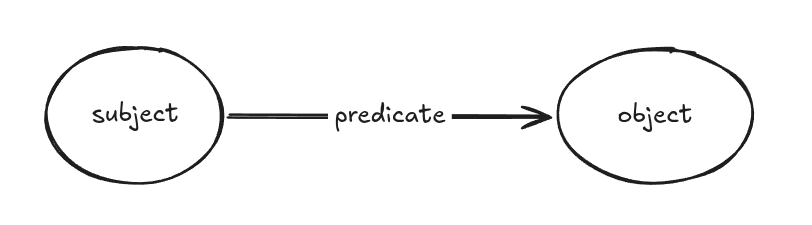

Summary goes here

<!--more-->
# Table of Contents
- [Introduction](#introduction)
  - [RDF](#RDF)
  - [SPARQL](#SPARQL)
  - [CONSTRUCT queries](#Construct)
  - [QLever](#QLever)
- [Problem Statement](#problem_statement)
- [Approach](#approach)
- [Previous Work](#Previous_Work)
- [Implementation](#implementation)
- [Evaluation](#evaluation)
- [Discussoin](#discussion)

# Introduction
## RDF
The Resource Description Framework (RDF) is a method to describe and exchange graph data.[^2]

RDF allows us to make statements about resources. The format of these statements is simple.
A statement always has the following structure:\
`<subject> <predicate> <object>`

An RDF statement expresses a relationship between two resources. The subject and the object represent the two resources
 being related; the predicate represents the nature of their relationship. The relationship is phrased in a directional
 way (from subject to object) and is called in RDF a *property*.

RDF is a directed graph composed of such statements (also called triple statements, since one statement consists of
three parts: subject, predicate, object.).
A set of RDF statements represent a graph in the following way: Each RDF triple statement is represented by: (1) a node
for the subject, (2) a directed edge from subject to object, representing a predicate, and (3) a node for the object.
See Figure 1 for a visual representation.

>
>
> _Figure 1: Visualization of an RDF triple._

```ntriples
<Bob> <is a> <person>.
<Bob> <is a friend of> <Alice>.
<Bob> <is born on> <the 4th of July 1990>. 
<Bob> <is interested in> <the Mona Lisa>.
<the Mona Lisa> <was created by> <Leonardo da Vinci>.
<the video 'La Joconde à Washington'> <is about> <the Mona Lisa>
```

The same resource is often referenced in multiple triples.
In the example above, Bob is the subject of four triples, and the Mona Lisa is the subject of one and the object of two
triples. This ability to have the same resource be in the subject position of one triple and the object position of
another makes it possible to find connections between triples, which is an important part of RDF's power.

We can visualize triples as a connected graph. Graphs consists of nodes and arcs.
The subjects and objects of the triples make up the nodes in the graph; the predicates form the arcs. Fig. 1 shows the
graph resulting from the sample triples.

## SPARQL 
SPARQL is an RDF query language, that is, a query language for retrieving and manipulating data stored in RDF format.


TODO: Explain a very simple example (SELECT) query, also use image

## CONSTRUCT queries 
TODO: what are CONSTRUCT queries?

TODO: what are CONSTRUCT queries used for / useful for?

TODO: example construct query?

## QLever 
TODO: what is qlever in one sentence

TODO: how does the engine work big picture 


TODO: how do the engine work big picture 

# Problem Statement
TODO: show that the construct export in comparison to the non-construct export is very slow.

TODO: "we want to make it faster"

# Approach 
TODO: Explain benchmark -> analyze -> hypothesis -> verification cycle.

# Implementation 
TODO: show profiles of example queries and identify bottlenecks there.

TODO: Analyze the code of the previous version of the algorithms and point out where work is duplicated for example.
And how I managed to deduplicate it.

# Evaluation
TODO: think of representative queries / real world queries / fitting queries to show how performance improved.

# Discussion 
TODO:Outlook how we can further improve the performance of exporting results, i.e. turning ids into iris/literals
essentially.

References
[^1]: W3 Org. "RDF Primer" https://www.w3.org/TR/rdf11-primer/ Accessed 2026-03-16.
[^2]: Wikipedia. "RDF" TODO:wikipedia-link-here Accessed 2026-03-17.
